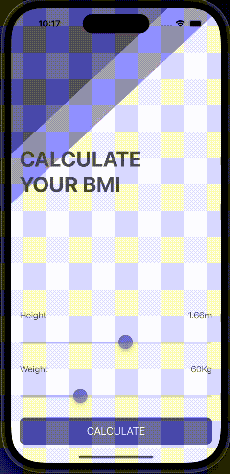

#  BMI Calculator

A BMI (Body Mass Index) calculator. Based on the user’s weight and height it will calculate their body mass and give a piece of health advice.

## Technical Points
- Create multi-screen apps with animated navigation: segues, prepare segue
- Optional binding, optional chaining and the nil coalescing operator.
- Create classes and structs
- Pass by value vs. pass by reference
- Formatting strings
- Using Swift color literals

